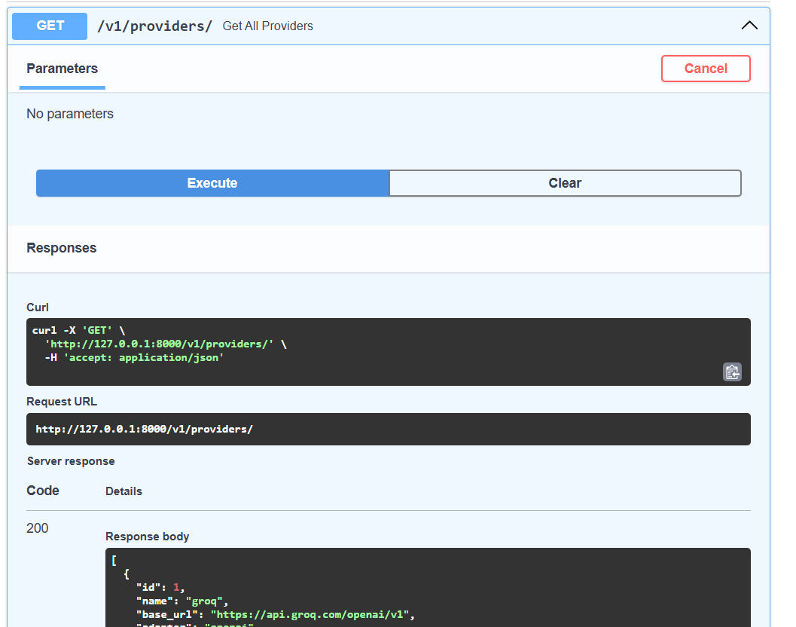
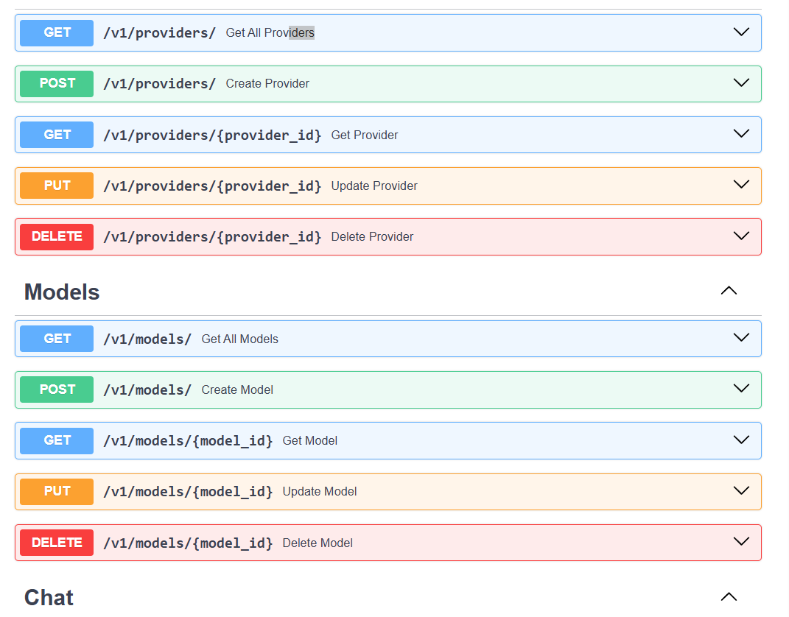
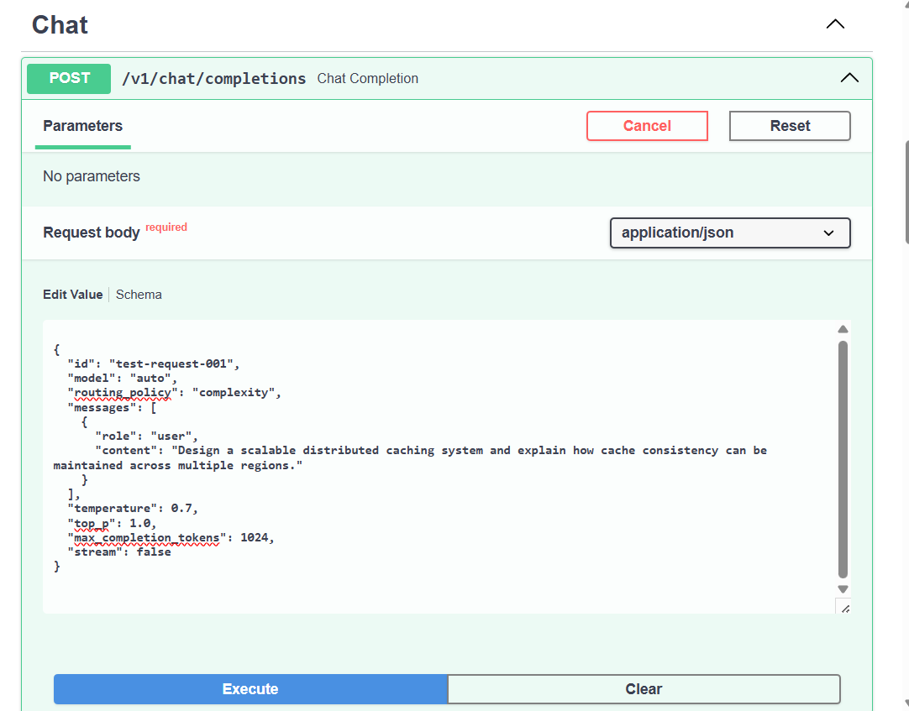
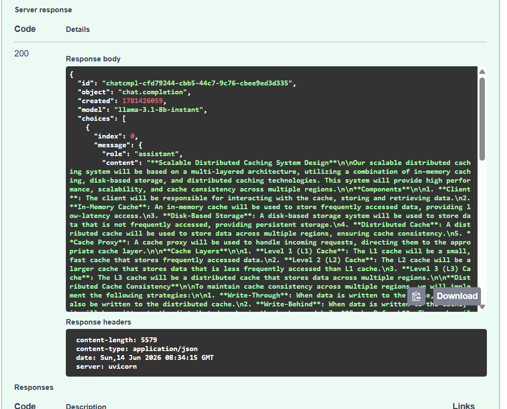

# RouteLLMESH


> **An OpenAI-compatible intelligent LLM Gateway with dynamic model routing, automatic fallback, and provider abstraction.**

RouteLLMESH is a production-oriented LLM gateway designed to simplify multi-provider AI deployments while optimizing for cost, capability, and reliability.

Instead of binding applications to a single model or provider, RouteLLMESH acts as an intelligent routing layer that transparently selects the most suitable model based on routing policies such as prompt complexity or cost.

Applications only need to change:

* `base_url`
* `api_key`

and can immediately leverage intelligent routing across multiple providers without modifying application logic.

---

# Why RouteLLMESH?

Modern AI applications often integrate directly with a single LLM provider, making them tightly coupled, difficult to migrate, and vulnerable to provider outages.

RouteLLMESH acts as an intelligent routing layer between your application and multiple LLM providers, enabling dynamic model selection, automatic fallback, and provider abstraction without changing application code.

Instead of hardcoding model or provider choices, RouteLLMESH analyzes each request and routes it to the most suitable model based on configurable routing policies.

## Without RouteLLMESH

```text
Application
      │
      ▼
OpenAI API
      │
      ▼
GPT-4o
```

* Single provider dependency
* Manual model selection
* No automatic fallback
* Difficult provider migration
* Higher operational cost
* Application owns routing logic

---

## With RouteLLMESH

```text
Application
      │
      ▼
RouteLLMESH
      │
      ▼
Routing Engine
      │
      ▼
Ranked Candidate Models
      │
      ▼
Automatic Fallback
      │
      ▼
Provider Factory
      │
      ├────────► OpenAI
      │
      ├────────► Groq
      │
      ├────────► Together AI
      │
      └────────► Future Providers
```

RouteLLMESH becomes the single entry point for all LLM traffic while transparently handling routing and execution.

## Key Advantages

* **OpenAI-Compatible API** — Migrate existing applications by changing only `base_url` and `api_key`.
* **Intelligent Routing** — Automatically select the best model using complexity or cost-based policies.
* **Automatic Fallback** — Retry the next ranked candidate when a model fails.
* **Provider Abstraction** — Switch providers without modifying application code.
* **Cost Optimization** — Route simple requests to cheaper models while reserving advanced models for complex tasks.
* **Streaming Support** — Compatible with streaming chat completions.
* **Production-Oriented Architecture** — Built with clean architecture, repository pattern, strategy pattern, and dependency injection.

## Project Vision

RouteLLMESH aims to become an intelligent service mesh for Large Language Models.

Rather than being a simple proxy, it provides a policy-driven execution layer that enables applications to use multiple providers seamlessly while optimizing for capability, reliability, and cost.

The long-term vision includes:

* Intelligent hybrid routing
* Health-aware model selection
* Retry and resilience policies
* Provider load balancing
* Budget-aware routing
* Observability and tracing
* Enterprise-grade AI infrastructure

RouteLLMESH allows developers to focus on building AI applications while the gateway intelligently manages model selection, execution, and resilience behind the scenes.

---


# Features

## OpenAI-Compatible API

Compatible with the OpenAI Chat Completions API.

Applications can switch to RouteLLMESH by changing only the endpoint and API key.

---

## Intelligent Model Routing

Supports automatic model selection through configurable routing policies.

Example:

```json
{
  "model": "auto",
  "routing_policy": "complexity"
}
```

RouteLLMESH analyzes the incoming prompt and selects the most appropriate model from the available pool.

---

## Complexity-Based Routing

Automatically evaluates prompt complexity and ranks candidate models using metadata-driven scoring.

Routing decisions consider:

* Model priority
* Reasoning capability
* Context window
* Input cost
* Output cost
* Tool support
* Vision support

No model names are hardcoded into the routing algorithm.

---

## Cost-Based Routing

Optimizes inference cost by selecting the most economical model capable of serving the request.

Useful for high-volume production workloads.

---

## Automatic Ranked Fallback

Routing returns an ordered candidate list instead of a single model.

Example:

```
1. llama-3.3-70b
2. qwen-32b
3. gemma-3-4b
```

If the preferred model fails, RouteLLMESH automatically retries the next ranked candidate without requiring client-side logic.

---

## Circuit Breaker

Implements a production-style circuit breaker to prevent repeated requests to failing models.

Supports:

* CLOSED
* OPEN
* HALF_OPEN

This improves resilience and reduces unnecessary provider latency during outages.

---

## Streaming Support

Supports OpenAI-compatible streaming responses.

```json
{
  "stream": true
}
```

Streaming works transparently across supported providers.

---

## Provider Abstraction

Provider-specific implementations are hidden behind a common adapter interface.

Current architecture allows adding new providers without modifying business logic.

---

## Redis Metadata Cache

Model and provider metadata are cached in Redis to minimize database access during request execution.

---

## Clean Architecture

The project follows modern backend engineering principles including:

* SOLID Principles
* Strategy Pattern
* Repository Pattern
* Service Layer
* Dependency Injection
* Open/Closed Principle

Routing policies are fully extensible and can be added without changing existing implementations.

---

# Architecture

```
                Client

                   │

                   ▼

        OpenAI Compatible API

                   │

                   ▼

             Chat Service

                   │

                   ▼

           Routing Engine

                   │

                   ▼

        Routing Policy Strategy

         ┌─────────┴─────────┐

         ▼                   ▼

 Complexity Router      Cost Router

                   │

                   ▼

       Ranked Candidate Models

                   │

                   ▼

          Automatic Fallback

                   │

                   ▼

          Circuit Breaker

                   │

                   ▼

          Provider Factory

                   │

                   ▼

          Provider Adapter

                   │

                   ▼

      OpenAI / Groq / Together / ...
```

---

# Tech Stack

* Python
* FastAPI
* PostgreSQL
* SQLAlchemy Async
* Alembic
* Redis
* Docker
* Pydantic

---
# Routing Policies

RouteLLMESH uses a policy-driven routing engine that determines the most appropriate model for each request. Every routing policy implements a common interface, allowing new strategies to be added without modifying the core routing engine.

A request can specify a routing policy explicitly:

```json
{
  "model": "auto",
  "routing_policy": "complexity"
}
```

If no policy is specified, the default routing strategy is applied.

---

## Complexity Policy

The **Complexity Policy** is the flagship routing strategy of RouteLLMESH.

Instead of relying on hardcoded model mappings, the gateway analyzes the incoming prompt and computes a complexity score. Every enabled model is then evaluated against multiple metadata attributes to produce a deterministic routing score.

Scoring factors include:

* Model priority
* Reasoning capability
* Context window size
* Input cost
* Output cost
* Tool support
* Vision support

The model with the highest routing score becomes the primary candidate, while the remaining ranked models act as automatic fallbacks.

Example:

```text
Complexity Score : 8.4

Ranked Candidates

1. llama-3.3-70b
2. qwen-32b
3. gemma-3-4b
```

This strategy balances capability and cost while remaining fully explainable and data-driven.

---

## Cost Policy

The **Cost Policy** minimizes inference cost by selecting the least expensive model capable of serving the request.

Estimated request cost is calculated using:

* Estimated input tokens
* Estimated output tokens
* Model input pricing
* Model output pricing

When multiple models have similar costs, model priority is used as a deterministic tie-breaker.

This policy is well suited for high-volume production workloads where cost optimization is critical.

---

## Thompson Sampling Policy (Experimental)

RouteLLMESH also includes an experimental **Thompson Sampling** routing strategy inspired by Multi-Armed Bandit algorithms.

Instead of relying solely on static metadata, this policy continuously learns from historical request outcomes.

For each model, RouteLLMESH maintains a Beta distribution:

```text
Successes → α

Failures → β
```

During routing, the gateway samples from each model's probability distribution and selects the model with the highest sampled value.

After request completion:

* Successful requests increase α
* Failed requests increase β

This allows the routing engine to balance:

* Exploration of underutilized models
* Exploitation of historically successful models

As more requests are processed, the routing policy naturally converges toward models with higher observed success rates.

Example:

```text
Model A

α = 52

β = 8

Sample = 0.91

--------------------

Model B

α = 13

β = 4

Sample = 0.84

--------------------

Selected Model

Model A
```

This adaptive routing strategy enables RouteLLMESH to learn from real-world traffic patterns without requiring supervised machine learning models.

---

## Extensible Policy Architecture

The routing engine follows the Strategy Pattern, allowing new routing policies to be added independently of the core gateway.

Future routing policies include:

* Latency-aware routing
* Quality-first routing
* Hybrid weighted routing
* Budget-aware routing
* Health-aware routing
* Provider load balancing
* SLA-aware routing
* Enterprise custom policies

Every policy returns a ranked candidate list rather than a single model, enabling transparent automatic fallback and improving gateway resilience.

# Routing Flow

```
Incoming Request

        │

        ▼

Complexity Analyzer

        │

        ▼

Load Model Pool

        │

        ▼

Score Every Model

        │

        ▼

Generate Ranking

        │

        ▼

Try Candidate #1

        │

     Success?

    ┌───┴────┐

   Yes      No

    │        │

    ▼        ▼

 Return   Candidate #2

               │

               ▼

            Continue
```

---

# Design Goals

* Provider agnostic
* OpenAI compatible
* Deterministic routing
* Explainable routing decisions
* Self-healing execution
* Extensible routing strategies
* Production-oriented architecture

---

# Screenshots

## Swagger API Documentation

The RouteLLMESH gateway exposes an OpenAI-compatible REST API with support for intelligent routing, streaming, and automatic fallback.

<p align="center">
    
</p>

---

## Intelligent Routing

Requests specifying `"model": "auto"` are analyzed by the routing engine, scored against the available model pool, and executed using the highest-ranked candidate according to the selected routing policy.

<p align="center">
    
</p>

---

## Model & Provider Management

RouteLLMESH maintains a centralized model registry and provider abstraction layer, enabling seamless addition of new providers without changing application logic.

<p align="center">
    
</p>

---

## Automatic Fallback & Resilience

When the preferred model fails, RouteLLMESH automatically retries the next ranked candidate, providing transparent failover and improved reliability without client-side intervention.

<p align="center">
    
</p>


# Example Request

```json
{
  "model": "auto",
  "routing_policy": "complexity",
  "messages": [
    {
      "role": "user",
      "content": "Explain the CAP theorem with practical examples."
    }
  ]
}
```

---

# Roadmap

## Version 2

* Health-aware routing
* Retry policies
* Provider health management
* Prometheus metrics
* Grafana dashboards
* OpenTelemetry tracing
* Latency-aware routing
* Hybrid routing policies
* Budget-aware routing
* Kubernetes deployment

---

# Project Vision

Modern AI applications should not be tightly coupled to a single provider or model.

RouteLLMESH aims to provide an intelligent routing layer that automatically selects the optimal model based on request characteristics while handling failures transparently and maintaining compatibility with existing OpenAI-based applications.

---

# License

This project is licensed under the MIT License.
